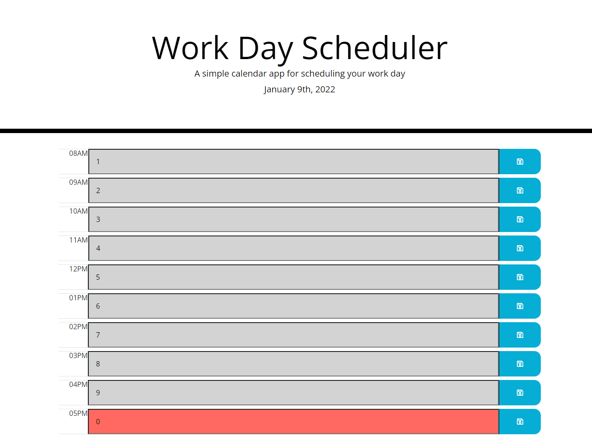
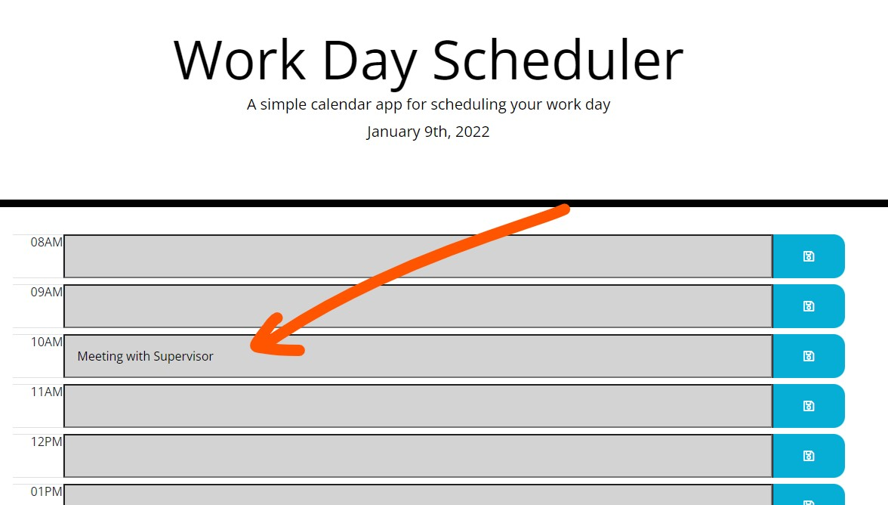
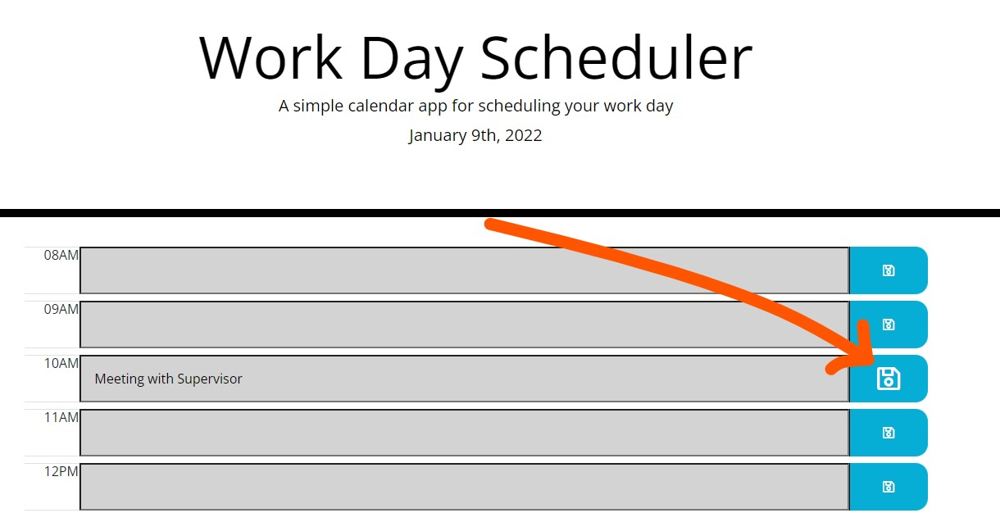

# Work Day Scheduler

## Table of Contents
- [Project Goal](##Project-Goal)
- [Technologies](##Technologies)
- [Links](##Links)
- [Screenshot of Application](Screenshot-of-Application)
- [User Instructions](##User-Instructions)
- [Acknowledgements](##Acknowledgements)

## Project Goal
The goals for this project include the following:
1. To create an application that allows the user to add important events to a daily planner.
2. Allow the user to save their events on their browser's local storage.
2. To have a display that is responsive to multiple screen sizes.

## Technologies
- Bootstrap
- jQuery
- MomentJS

## Links
- ### [URL to Deployed Application](https://inklein1997.github.io/Work-Day-Scheduler/)
- ### [URL to Github Repository](https://github.com/inklein1997/Work-Day-Scheduler)

## Screenshot of Webpage

## User Instructions
1. **Click** text box and **Type** in event.  

2. **Click Save Icon** to save event into local Storage.  

## Acknowledgements
- Header and CSS file were provided by the University of Texas at Austin Coding Bootcamp curriculum